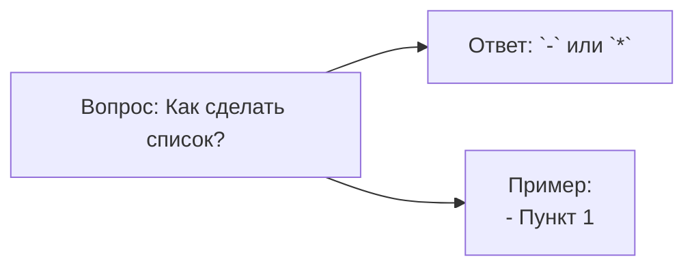
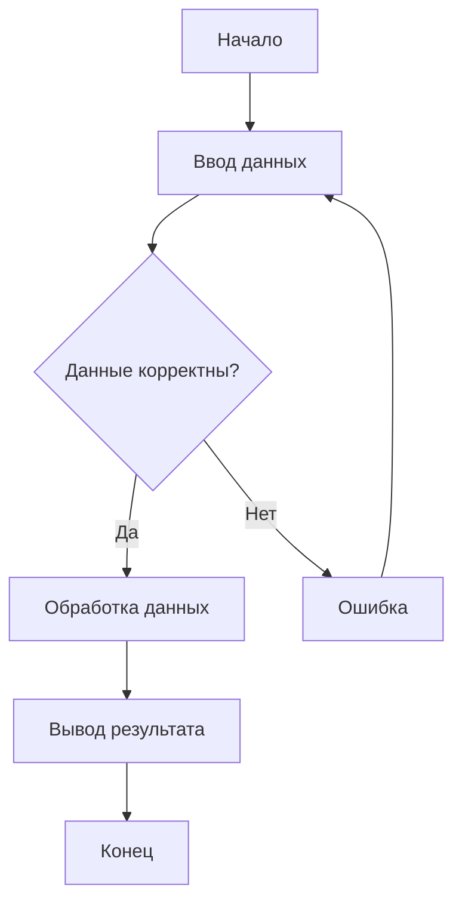
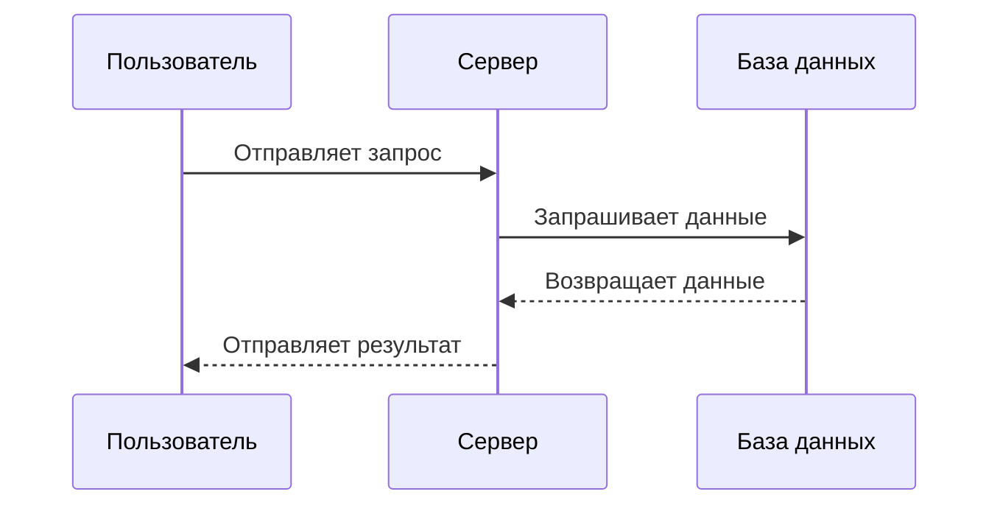
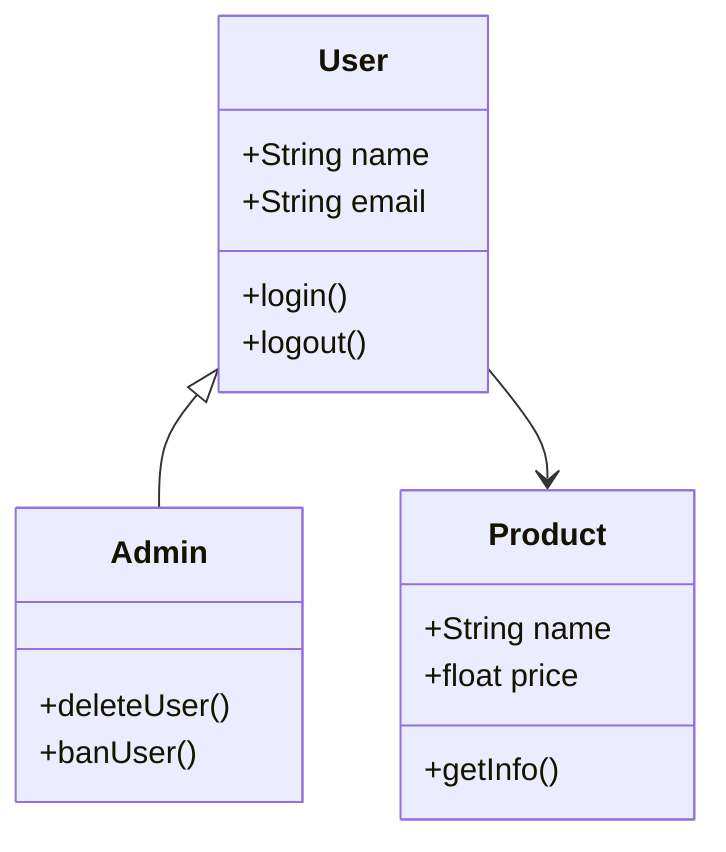
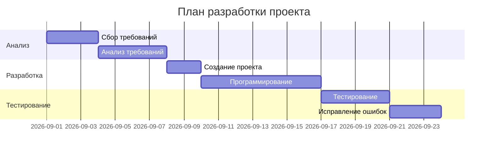
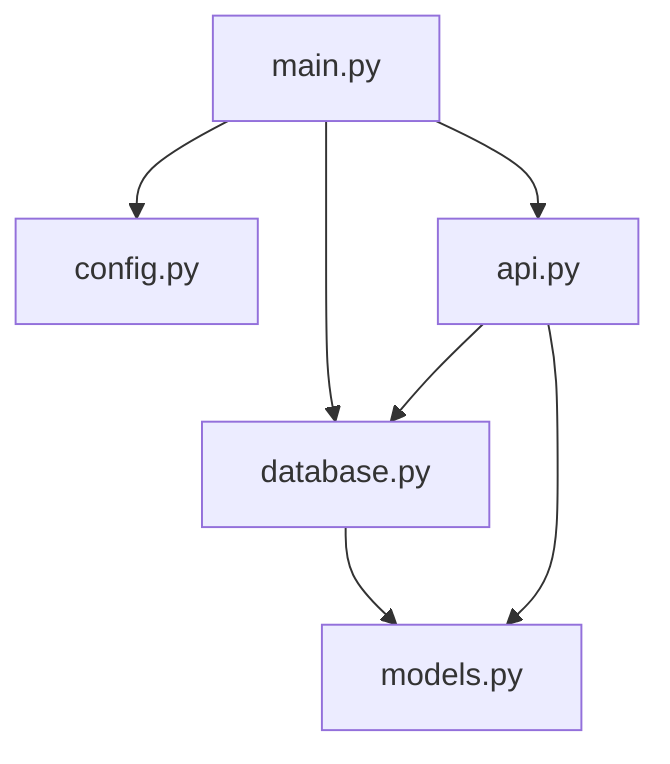
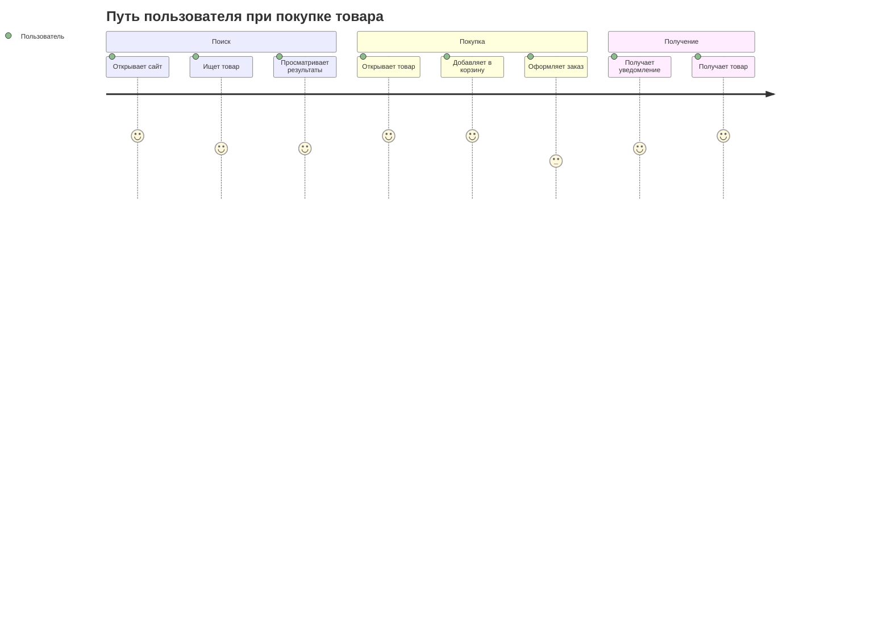
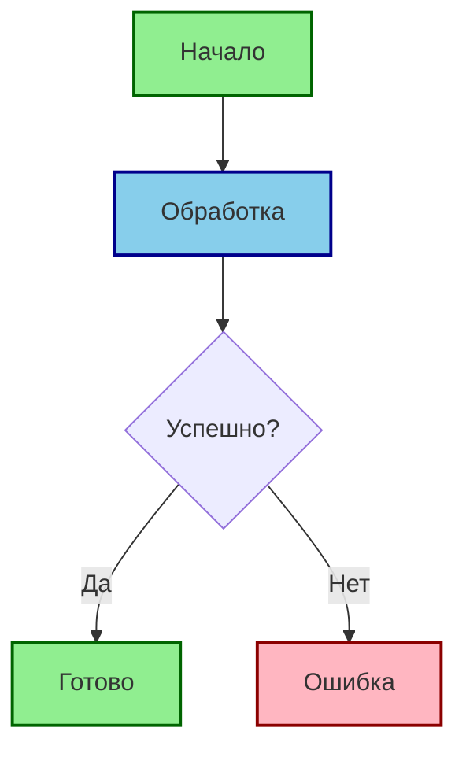
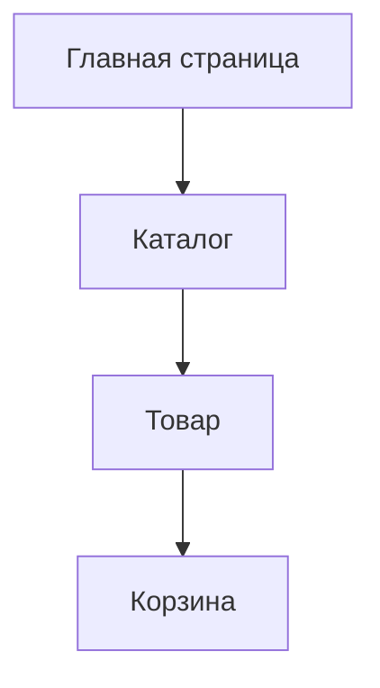
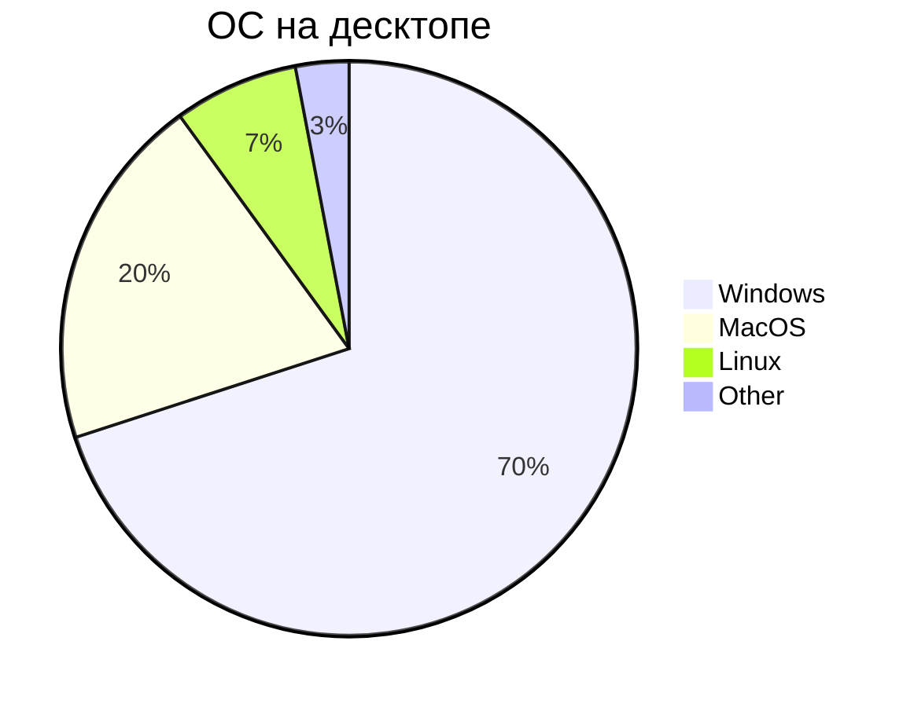

## Mermaid

**Mermaid** - это сильно упрощённый и далёкий аналог **UML** - специальный язык описани блок-схем, графиков и диаграмм с их визуализацией.

> **Самсостоятельно доделать это ридми**

### Блок схемы

#### Базовая структура 1

* `flowchart` - блок-схема
* `LR` - направление вправо
* `A[],B[],C[]` - прямоугольник
* --> - стрелка связи

Виды Mermaid-диаграмм
- Блок-схемы - `graph`, `flowchart`
- Последовательности - `sequenceDiagram`
- Классы - `classDiagram`
- Диаграмма Ганта - `gant`
- Круговые - `pie`
- Состояния
- ER-диаграммы
- Графы зависимостей

## Блок-схемы
Блок-схема показывает последовательность действий или алгоритм.



## Диаграмма последовательности

Показывает взаимодействие между несколькими объектами или участниками во времени.



## Диаграмма класса

Используется для представления классов, их свойств, методов и связей.



## Диаграмма Ганта

Используется для отображения задач и сроков выполнения проекта.



## Граф зависимостей

Граф зависимостей показывает, какие компоненты, модули или элементы зависят друг от друга.



## Диаграмма состояний

Показывает различные состояния объекта и переходы между ними.

stateDiagram-v2
    [*] --> Ожидание
    Ожидание --> Обработка: Получен запрос
    Обработка --> Успешно: Успех
    Обработка --> Ошибка: Ошибка
    Ошибка --> Ожидание: Повторить
    Успешно --> [*]

## User Journey

Показывает путь пользователя через различные этапы взаимодействия с системой.



## Кастомизация стилей

Mermai позволяет изменять внешний вид отдельных элементов диаграммы с помощью `style`.



## Классы CSS

Для нескольких элементов можно создать собственный стиль с помощью `classDef`.

```mermaid
flowchart LR
    A[Пользователь] --> B[Система]
    B --> C[Успех]
    B --> D[Ошибка]

    classDef user


fill:#DDEEFF,stroke:#336699,stroke-width:2px
    classDef success fill:#DDFFDD,stroke:#339933,stroke-width:2px
    classDef error fill:#FFDDDD,stroke:#CC3333,stroke-width:2px

    class A user
    class C success
    class D error
```

## Интерактивность

Mermaid позволяет добавлять действия при нажатии на элементы диаграммы с помощью `click`.



## Круговая диаграмма

